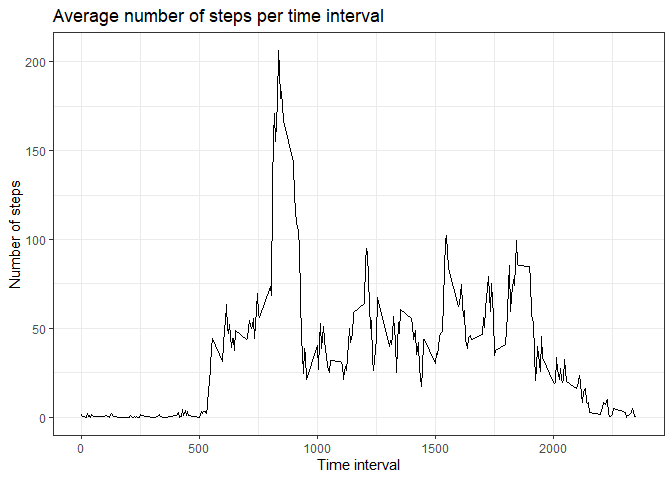

## Loading and preprocessing the data
In this section, the data is loaded from the original file and processed for further analysis. 

```r
#### Packages ####
library(lattice)
library(ggplot2)
```

```
## Warning: package 'ggplot2' was built under R version 4.1.1
```

```r
#### Data retrieval ####
data <- read.csv(unzip("activity.zip", "activity.csv"))
```


## What is mean total number of steps taken per day?
For this part of the assignment, you can ignore the missing values in the dataset.

1. Calculate the total number of steps taken per day

```r
daily_steps <- aggregate(data$steps, by=list(data$date), sum)
names(daily_steps) <- c("date", "steps")
```

2. If you do not understand the difference between a histogram and a barplot, research the difference between them. Make a histogram of the total number of steps taken each day.

```r
# png("figure/Histogram.png")
hist(daily_steps$steps, main="Daily steps histogram", xlab="Number of daily steps", breaks = 10)
```

<!-- -->

```r
# dev.off()
```

3. Calculate and report the mean and median of the total number of steps taken per day

```r
mean_steps <- mean(daily_steps$steps, na.rm=TRUE)
median_steps <- median(daily_steps$steps, na.rm=TRUE)
```
The mean daily steps value is 10766.19, and the median is 10765.

## What is the average daily activity pattern?
1.Make a time series plot (i.e. \color{red}{\verb|type = "l"|}type = "l") of the 5-minute interval (x-axis) and the average number of steps taken, averaged across all days (y-axis).

```r
interval_means <- aggregate(data$steps, by=list(data$interval), mean, na.rm=TRUE)
names(interval_means) <- c("interval", "steps")


# png("figure/Interval-timeseries.png")
ggplot(interval_means, aes(interval, steps, type="l")) +
       geom_line() +
       ggtitle("Average number of steps per time interval") + 
       xlab("Time interval") +
       ylab("Number of steps") +
       theme_bw()
```

<!-- -->

```r
# dev.off()
```
2. Which 5-minute interval, on average across all the days in the dataset, contains the maximum number of steps?

```r
max_index <- which(interval_means$steps==max(interval_means$steps))

max_interval <- interval_means[max_index,1]
```
The 5-minute time interval that contains the maximum number of steps is 835.

## Imputing missing values
Note that there are a number of days/intervals where there are missing values (coded as \color{red}{\verb|NA|}NA). The presence of missing days may introduce bias into some calculations or summaries of the data.

1. Calculate and report the total number of missing values in the dataset (i.e. the total number of rows with \color{red}{\verb|NA|}NAs).

```r
totalNA <- sum(is.na(data$steps))
```
The total number of NA in the data is 2304.

2. Devise a strategy for filling in all of the missing values in the dataset. The strategy does not need to be sophisticated. For example, you could use the mean/median for that day, or the mean for that 5-minute interval, etc.

The strategy used to fill the NA values is replacing them with the respective interval mean value.

3. Create a new dataset that is equal to the original dataset but with the missing data filled in.

```r
filled_data <- data
for (i in interval_means$interval){
    filled_data[filled_data$interval == i & is.na(filled_data$steps),]$steps <- interval_means$steps[interval_means$interval == i]
}
```

4. Make a histogram of the total number of steps taken each day and Calculate and report the mean and median total number of steps taken per day. Do these values differ from the estimates from the first part of the assignment? What is the impact of imputing missing data on the estimates of the total daily number of steps?

```r
filled_daily_steps <- aggregate(filled_data$steps, by=list(filled_data$date), sum)
names(filled_daily_steps) <- c("date", "steps")

# png("figure/Histogram-filled_data.png")
hist(filled_daily_steps$steps, main="Daily steps histogram (filled)", xlab="Number of daily steps", breaks = 10)
```

<!-- -->

```r
# dev.off()
```
The histogram looks the same. The mean daily steps value is 10766.19 remaining the same, however, the median is 10766.19 having the same value as the mean.

## Are there differences in activity patterns between weekdays and weekends?
For this part the \color{red}{\verb|weekdays()|}weekdays() function may be of some help here. Use the dataset with the filled-in missing values for this part.

1. Create a new factor variable in the dataset with two levels – “weekday” and “weekend” indicating whether a given date is a weekday or weekend day.

```r
filled_data$day <- weekdays(as.Date(filled_data$date))
filled_data$week <- ""
filled_data[filled_data$day == "Saturday" | filled_data$day == "Sunday", ]$week <- "weekend"
filled_data[!(filled_data$day == "Saturday" | filled_data$day == "Sunday"), ]$week <- "weekday"
filled_data$week <- factor(filled_data$week)
```

2. Make a panel plot containing a time series plot (i.e. \color{red}{\verb|type = "l"|}type = "l") of the 5-minute interval (x-axis) and the average number of steps taken, averaged across all weekday days or weekend days (y-axis). See the README file in the GitHub repository to see an example of what this plot should look like using simulated data.

```r
avg_steps <- aggregate(steps ~ interval + week, data=filled_data, mean)

# png("figure/Weekdays.png")
xyplot(steps ~ interval | week, data=avg_steps, type="l",
       layout = c(1, 2), 
       xlab = "Interval", 
       ylab = "Number of steps",
       main = "Average interval steps by weekday")
```

<!-- -->

```r
# dev.off()
```
